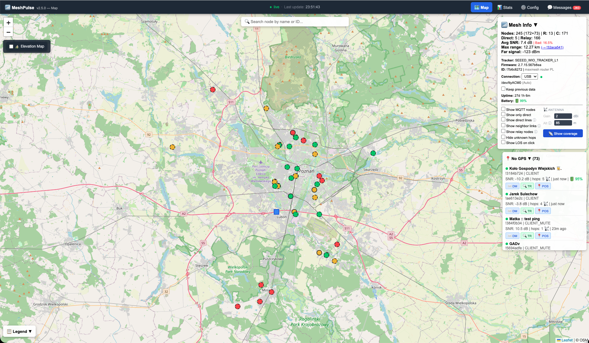

cat README.md 
# Meshtastic Network Mapper

Real-time web-based visualization of Meshtastic mesh network nodes. Optimized for low-power devices like Raspberry Pi Model B+.




## Features

- 📡 **Real-time node tracking** - Live position updates via WebSocket (falls back to polling)
- 🗺️ **Interactive map** - Leaflet.js-based web interface
- 💬 **Text messages** - Broadcasts and DMs displayed in Messages panel, persisted across restarts
- ⏰ **TTL (Time-To-Live)** - Automatic cleanup of stale nodes (48 hours default)
- 🔄 **Auto-restart** - Resilient to connection timeouts
- 📋 **JSON API** - Easy integration with other tools
- 📂 **Multi-tracker support** - Merge data from multiple trackers
- 🐢 **Slow hardware support** - Works on Raspberry Pi Model B+ (512MB RAM)
- 📏 **Max range display** - Shows distance to farthest directly reachable node (hops=0)
- 🎯 **Accurate node status** - Shows real last-heard time from tracker memory
- 🔗 **Direct connection lines** - See your real radio reach with SNR-colored lines from tracker to all hops=0 nodes
- 🔥 **Heat map** - Visualize network density across the map

## Node Colors (Real Network State)

The map shows **true network status** based on when your tracker last heard each node:

| Color | Age | Meaning |
|-------|-----|---------|
| 🟢 Green | < 1 hour | Recently heard - node is active |
| 🟡 Yellow | 1-6 hours | Not heard recently - may be inactive or out of range |
| 🔴 Red | > 6 hours | Stale - tracker hasn't heard this node for a long time |

**Note:** This reflects your tracker's perspective. A "red" node may still be active in the mesh but simply not heard by your specific tracker due to distance or obstacles.

### Shape Indicators
- **Square** = Router node
- **Circle** = Client node
- **Dashed border** = Relayed (hops > 0)


## Quick Start (Recommended)

### Requirements

- Raspberry Pi (Model B+ or newer) or similar Linux system
- Meshtastic tracker connected via USB
- Python 3.7+
- **Web browser:** Chrome or Firefox recommended (Safari has WebSocket issues)

### Step 1: Install dependencies
```bash
sudo apt update
sudo apt install python3 python3-pip lighttpd git -y
pip3 install meshtastic websockets --break-system-packages

# Add user to dialout group (for USB access)
sudo usermod -aG dialout $USER
# Logout and login for group change to take effect
```

### Step 2: Clone and install
```bash
cd ~
git clone https://github.com/maxg10/meshtastic-network-mapper.git
cd meshtastic-network-mapper
./install.sh
```

### Step 3: Start and verify
```bash
sudo systemctl start meshtastic-mapper
sudo systemctl status meshtastic-mapper
```

### Step 4: Open in browser
```
http://YOUR_PI_IP/meshtastic/
```

---

## Manual Installation

If you prefer to install manually or want to understand what's happening:
```bash
# 1. Install dependencies
sudo apt update
sudo apt install python3 python3-pip lighttpd -y
pip3 install meshtastic websockets --break-system-packages

# 2. Start and enable web server
sudo systemctl enable lighttpd
sudo systemctl start lighttpd

# 3. Clone repository
cd ~
git clone https://github.com/maxg10/meshtastic-network-mapper.git
cd meshtastic-network-mapper

# 4. Setup web directory
sudo mkdir -p /var/www/html/meshtastic
sudo cp frontend/index.html /var/www/html/meshtastic/
sudo cp frontend/favicon.ico /var/www/html/meshtastic/
sudo chown -R $USER:$USER /var/www/html/meshtastic

# 5. Test manually (important!)
python3 backend/meshtastic_mapper.py
# Press Ctrl+C after 2-3 minutes once you see nodes appearing

# 6. Verify JSON was created
cat /var/www/html/meshtastic/nodes.json

# 7. Open in browser to test
# http://YOUR_PI_IP/meshtastic/

# 8. Install systemd service using install.sh
./install.sh

# 9. Start service
sudo systemctl start meshtastic-mapper
sudo systemctl status meshtastic-mapper
```


## Updating

If you already have meshtastic-network-mapper installed and want to update to the latest version:
```bash
# 1. Navigate to repository
cd ~/meshtastic-network-mapper

# 2. Pull latest changes from GitHub
git pull origin main

# 3. Check what changed
git log --oneline -5

# 4. Re-run installer (updates service and frontend)
./install.sh

# 5. Restart service
sudo systemctl restart meshtastic-mapper

# 6. Verify it's running
sudo systemctl status meshtastic-mapper

# 7. Check logs for new features
sudo journalctl -u meshtastic-mapper -f
```

### What's New in Latest Version

## What's New in v2.0.6 — NeighborInfo Topology

**Config page (new):**
- 📱 Full device configuration via web UI — Device, LoRa, Position, Telemetry, Network, Bluetooth
- 📻 Channel editor — name, PSK (default/random/custom hex/base64), role (PRIMARY/SECONDARY/DISABLED)
- ⭐ Favorites management — set/remove favorite nodes directly in firmware via Python API
- 🔌 Shows current device IP address (TCP mode) with copy button
- ⏳ Smart retry when TCP device not yet connected on page load

**Messages page (new):**
- 💬 Standalone messages.html — no longer overlaps the map
- 🔔 Unread badge in navbar across all pages
- 📻 Shows all configured channels even when empty
- 📨 Send broadcast and DM from dedicated page

**Bug fixes:**
- 🐛 Nodes no longer appear in both GPS and No GPS panel simultaneously
- 🐛 ROUTER_LATE role correctly mapped to value 11 (firmware 2.7+)
- 🐛 Enum fields (role, region, modem_preset) correctly cast to int on save
- 🐛 BrokenPipe after device reboot treated as success, not error
- 🐛 TCPMeshtasticInterface proxy for localNode, nodes, getMyNodeInfo
- 🐛 PSK copy button works on HTTP/Safari (execCommand fallback)
- 🐛 Config auto-retries when TCP connection not yet established

**v1.19 - Serial Python API & Traceroute Improvements**
- 🔌 Serial (USB) connection now uses Python Meshtastic API — same as TCP, no more subprocess parsing
- 🔍 Traceroute fixed: shows full route with node names, SNR values, and map lines
- 🔍 Traceroute works without pausing listener — no more 30-60s interruptions
- 🔁 Most Active Nodes: new "Via" column showing which node relayed each packet
- 💬 DM improvements: search box in Messages panel, DM button next to each message
- 🗺️ TR button in No GPS panel for quick traceroute to any node
- 🔽 Collapsible panels now show ▼/▶ to indicate open/closed state
- 🐛 Many fixes: panel positioning, navbar z-index, traceroute SNR scaling, race conditions

**v1.18 - Navigation & Stats Improvements**
- 🧭 Top navigation bar on all pages with 3-column layout (title | status | nav links)
- 🔴 WebSocket status moved to navbar center with live/connecting/offline label
- 🔧 Watchdog: auto-restarts serial listener after 10min silence (fixes frozen meshtastic --listen)
- 📊 Most Active Nodes: one row per node per packet type — see exactly who spams position vs telemetry
- 🗑️ Clear node stats button — reset packet history for any node instantly
- 🏔️ LOS fixed: switched to opentopodata.org via WebSocket proxy (CORS bypass)
- ⚠️ Anomaly improvements: correct CLI syntax, time-ago display, no false positives for own node
- 🎯 Node TTL reduced to 24h — map and stats now consistent
- 🔁 Relay detection improved: now tracks all packet types, not just position
- 🐛 Many bug fixes: chart sizing, resize, active node count, data window display

**v1.16 - Python Meshtastic API for TCP**
- Native Python `meshtastic.tcp_interface.TCPInterface` used for TCP connections (no CLI subprocess)
- TCP listener no longer stops when sending a message — send uses a dedicated short-lived connection
- Real-time packet callbacks replace stdout parsing for TCP mode (nodeinfo, position, telemetry, text)
- Cleaner TCP reconnect loop with same auto-restart behavior as serial mode

**v1.13 - Traceroute & LOS Improvements**
- 🔍 Traceroute feature - click any node popup to run traceroute
- 🗺️ Traceroute route visualization with colored lines on map (SNR color-coded)
- ⏱️ Countdown timer during traceroute with friendly timeout messages
- ⚠️ USB warning dialog before traceroute (listener pauses ~60s)
- 📡 RSSI displayed in all node popups (with "last hop" note for relay nodes)
- 📏 Far signal indicator in Mesh Stats (RSSI of farthest direct node)
- 📻 Radio Stats panel (channel utilization, bad packets, TX relay, online nodes)
- 🌍 Earth curvature correction in LOS analysis (accurate for long distances)
- 🎨 Improved LOS chart (earth tones, obstruction zone, Fresnel zone)
- 📋 Memory source indicator - nodes loaded from memory show "from memory" in popup
- ⏰ TTL reduced from 7 days to 48 hours (more accurate network view)
- 🔧 Fixed: traceroute no longer clears nodes.json on USB restart
- 🔧 Fixed: standardized fonts across all panels
- 🔧 Fixed: panel layout (no overlapping)

**v1.11 - RF Line of Sight Analysis**
- 📡 Line of Sight panel with terrain elevation profile
- 🏔️ Real terrain data from Open-Elevation API
- 📊 Interactive Chart.js visualization
- 🌊 Fresnel zone (60%) clearance calculation
- ✅ Clear/Obstructed status indicator
- 🎚️ "Show LOS on click" checkbox to enable/disable feature
- 🏠 Antenna height estimation: terrain elevation + 10m offset

**v1.10 - Enhanced Popups & Tracker Marker**
- 📍 Your tracker now shows as blue marker with special popup (YOUR TRACKER)
- 📏 Distance displayed in popup for direct nodes (hops=0)
- 🎨 Improved popup readability with Inter font
- 👤 Role field added to node popups
- 🔍 "Hide unknown hops" filter to remove nodes without hop data (MQTT/unknown)
- 🏠 Own tracker always visible regardless of filters

**v1.9 - Safari WebSocket Fix**
- 🦁 Safari detection with longer WebSocket delays (500ms connect, 2s retry vs 100ms/1s for other browsers)

**v1.8 - Direct Connection Lines & Heat Map**
- 🔗 Direct connection lines - visual lines from tracker to all hops=0 nodes, color-coded by SNR (green ≥5, yellow ≥-5, red <-5)
- 🔥 Heat map - node density visualization using leaflet.heat

**v1.7 - Message Persistence & Cache Busting**
- 💾 Messages now saved to `nodes.json` and restored on restart/page refresh
- 🔄 Cache-busting meta tags and versioned CSS to prevent stale browser caches

**v1.6 - WebSocket & Text Messages**
- ⚡ WebSocket server (port 8765) for real-time updates without page refresh
- 💬 Text message parsing and display (broadcasts and DMs)
- 🔌 Serial port auto-detection
- 📡 Node deletion broadcasts when TTL expires
- ⬆️ Default TTL increased from 24h to 7 days

**v1.5 - Universal Installer**
- 🔧 Added `install.sh` for easy installation
- 📝 Service file template (no more hardcoded usernames)
- ✅ Dependency checker with helpful install commands
- 🔄 Simplified update process

**v1.4 - Accurate Node Status & Tracker Info**
- 🎯 Uses real `lastHeard` timestamp from tracker's memory
- ♡ Telemetry heartbeat keeps local nodes fresh
- 🔴 Node colors now reflect true network state
- 📡 Tracker info display (model, firmware, ID, port)
- 🔘 Filter to show only direct nodes (hops=0)
- 🚫 MQTT nodes excluded from max range calculation

**v1.3 - Max Range Feature**
- 📏 Distance calculation to farthest directly reachable node (hops=0)
- 🔍 Click to locate farthest node on map
- 🆔 Auto-detection of local node ID

**v1.2 - TTL & Multi-Tracker Support**
- ⏰ Automatic cleanup of nodes older than 24 hours (configurable)
- 📂 Load existing nodes from previous runs
- ✚/↻ Visual indicators for new vs updated nodes

### Backup Before Update (Optional)
```bash
# Backup current nodes.json
cp /var/www/html/meshtastic/nodes.json ~/nodes_backup_$(date +%Y%m%d).json
```


## TCP Connection (WiFi Trackers)

If your tracker has WiFi (Heltec V3, T-Beam, T-Deck, Station G2), you can connect over TCP instead of USB:

1. Enable WiFi on your tracker via the Meshtastic app
2. Note the tracker's IP address (shown in the app)
3. In the web interface, open **Mesh Stats** and change **Connection** from `USB` to `TCP`
4. Enter the IP address and click **Connect**

The backend will restart automatically with the new connection settings. Your choice is saved to `config.json` and persists across service restarts.

**Benefits:**
- Tracker can be on a roof or remote location without a USB cable
- Power via PoE adapter or solar panel
- One Raspberry Pi can be reconfigured to connect to different trackers

**Requirements:**
- Tracker and Raspberry Pi must be on the same local network
- Meshtastic firmware with WiFi support

## Configuration

Edit `backend/meshtastic_mapper.py` if needed:
```python
self.port = '/dev/ttyUSB0'  # Change if tracker on different port (auto-detected by default)
self.json_path = '/var/www/html/meshtastic/nodes.json'  # Output path
self.max_age = 172800  # Node TTL in seconds (48 hours default)
```

### Change TTL (Time-To-Live)

Nodes older than `max_age` seconds are automatically removed:
```python
# In backend/meshtastic_mapper.py, find the ListenBasedMapper instantiation:
mapper = ListenBasedMapper(port, max_age=172800)  # 48 hours (default)
# Change to:
mapper = ListenBasedMapper(port, max_age=86400)   # 24 hours
# Or:
mapper = ListenBasedMapper(port, max_age=172800)  # 48 hours
```

### Max Range Requirements

For the max range feature to work, your local tracker must have a position set:
- **GPS** - tracker with built-in GPS that reports position automatically
- **Fixed position** - manually set coordinates:
```bash
meshtastic --port /dev/ttyUSB0 --setlat 52.XXXXX --setlon 16.XXXXX
```


## Architecture

### Backend (`backend/meshtastic_mapper.py`)

- Uses `meshtastic --listen` mode to capture node information
- Parses debug output to extract position, telemetry, and text message data
- Saves nodes + messages to JSON every 60 seconds
- WebSocket server on port 8765 for real-time push updates
- Auto-restarts on timeout/errors

### Frontend (`frontend/index.html`)

- Leaflet.js for interactive map
- Primary: WebSocket connection for real-time updates
- Fallback: polls `nodes.json` every 15 seconds
- Messages panel shows broadcasts and DMs, persisted across page refreshes
- Shows node name, ID, SNR, altitude, hops, age

### Data Format
```json
{
  "ts": 1736625600,
  "updated": "2025-01-11T18:40:00",
  "cnt": 7,
  "cnt_no_pos": 2,
  "max_distance_km": 7.0,
  "farthest_node": "!e36738ab",
  "tracker": {"id": "!7b6c8272", "model": "TBEAM", "firmware": "2.5.0"},
  "nodes": [
    {
      "id": "!7b6c8272",
      "name": "Node Name",
      "lat": 52.353434,
      "lon": 16.865690,
      "alt": 75,
      "snr": 10.8,
      "role": "ROUTER",
      "hops": 0,
      "ts": 1736625600
    }
  ],
  "nodes_no_pos": [],
  "messages": [
    {
      "from_id": "!7b6c8272",
      "from_name": "Node Name",
      "text": "Hello mesh!",
      "timestamp": 1736625600,
      "is_dm": false
    }
  ]
}
```


## Troubleshooting

### Web server not running
```bash
# Check lighttpd status
sudo systemctl status lighttpd

# Start if stopped
sudo systemctl start lighttpd

# Check if port 80 is listening
sudo netstat -tlnp | grep :80
```

### Service fails to start
```bash
# Check logs
sudo journalctl -u meshtastic-mapper -n 50

# Test script manually
python3 ~/meshtastic-network-mapper/backend/meshtastic_mapper.py

# Verify paths in service
sudo systemctl cat meshtastic-mapper
```

### Tracker not detected
```bash
# Check USB devices
ls -la /dev/ttyUSB* /dev/ttyACM*

# Check if user has access (add to dialout group)
sudo usermod -aG dialout $USER
# Log out and back in for group changes to take effect

# Test meshtastic connection
meshtastic --port /dev/ttyUSB0 --info
```

### Map shows 0 nodes
```bash
# Check JSON file
cat /var/www/html/meshtastic/nodes.json

# Verify web server
curl http://localhost/meshtastic/nodes.json
```

### Heltec V3 timeout issues

If you're using Heltec V3 and getting "Timed out waiting for connection completion" errors, add `--no-nodes` flag to the command in `backend/meshtastic_mapper.py`:
```python
cmd = [self.meshtastic_cmd, '--port', self.port, '--listen', '--no-nodes']
```


## Performance Notes

**Raspberry Pi Model B+ (512MB RAM):**
- Initial node discovery: ~2-3 minutes
- CPU usage: ~15-20% average
- RAM usage: ~40MB for Python process
- Works reliably with 10+ nodes

**Faster devices:** Will have near-instant node discovery.


## Known Limitations

- **Safari WebSocket issues:** Safari has timing issues with WebSocket connections. The app works but may take longer to establish real-time connection. **Chrome or Firefox recommended.**
- **No authentication:** WebSocket server assumes trusted LAN environment
- **MQTT nodes:** Appear in data but excluded from max range calculation (not real radio contacts)
- **Relies on meshtastic CLI:** Parser may need updates if CLI output format changes
- **Timeout issues:** `meshtastic --nodes` times out on slow Pi - we use `--listen` mode instead
- **No real-time packets:** Only updates when nodes broadcast position (every 15-30 min typically)


## Contributing

Pull requests welcome! Areas for improvement:

- [ ] MQTT support for faster updates
- [ ] Node history/trails on map
- [ ] Network topology visualization
- [ ] Mobile-friendly UI improvements
- [ ] WebSocket authentication (currently assumes trusted LAN)


## Author

**Mariusz "Max" Gieparda**

📧 [mgieparda@yahoo.com](mailto:mgieparda@yahoo.com)
🐙 [github.com/maxg10](https://github.com/maxg10)
📦 [github.com/maxg10/meshtastic-network-mapper](https://github.com/maxg10/meshtastic-network-mapper)

Built with ❤️ for the Meshtastic community in Poland 🇵🇱

*Feel free to reach out with questions, bug reports, or feature requests!*


## License

MIT License - See [LICENSE](LICENSE) file


## Credits

Built for the Polish Meshtastic community around Poznań 🇵🇱

- Meshtastic: https://meshtastic.org
- Leaflet.js: https://leafletjs.com


## Screenshots


*Active nodes in Poznań metro area*

---

**Questions?** Open an issue on GitHub!

---

© 2025 Max Gieparda | MIT License
